# Tinder App Flutter
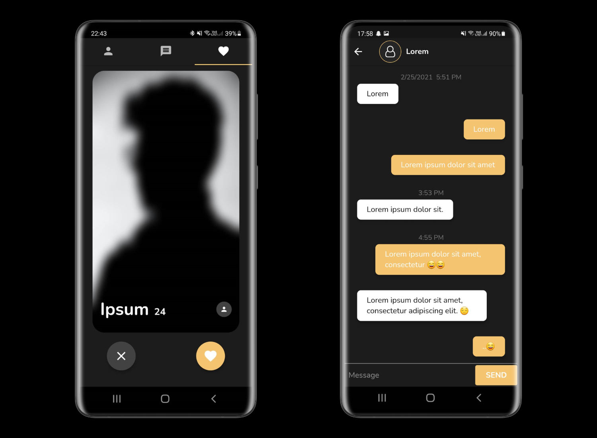 

## Introduction
This is a demo application built with the goal to learn about Flutter and to create a fun application.

Tested on Android only.

## Technologies & Architecture
Flutter, Dart

#### Firebase 
* Authentication
* Firestore
* Storage

#### Architecture components
* Provider

## Features

**Start screen:** Login/Register

**Profile screen:** Change image, change bio, logout

**Chats screen:** List of chats(matches)

**Chat screen:** Messaged sorted by timestamp, send and show messages

**Match screen:** Image and information of person, like/dislike 

**Matched screen:** Show users included in match

**General:** Auto login, basic error handling, progress bar

**Firebase:** Storing user info, chats, images

## Screenshots

### Start | Login | Register

  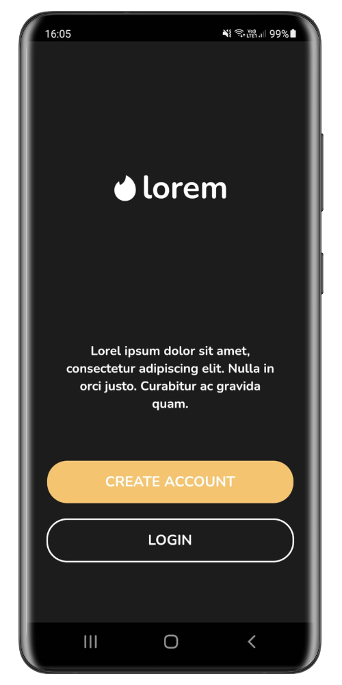
  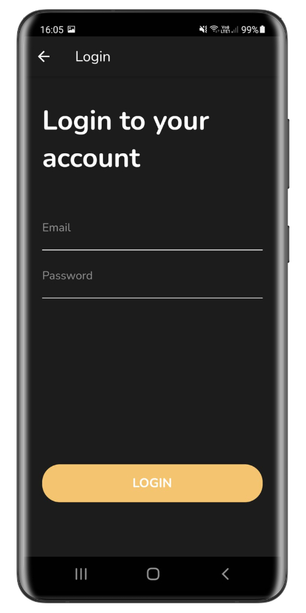 
  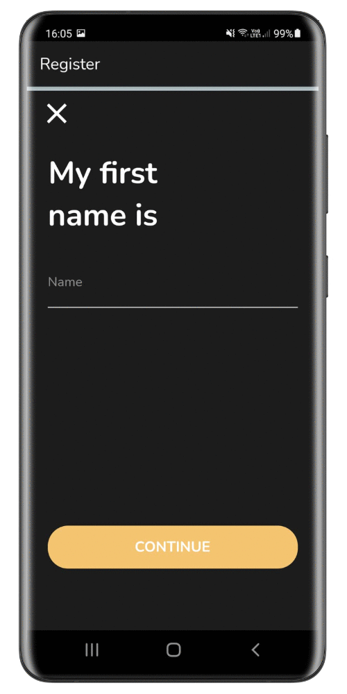 

### Profile | Chats | Match

  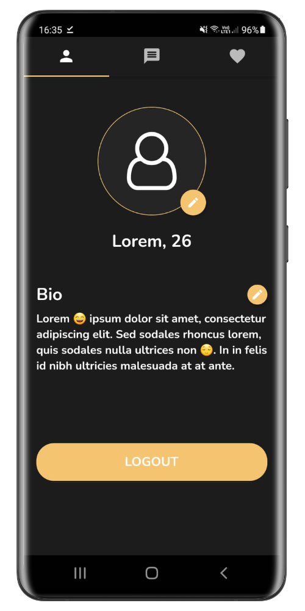
  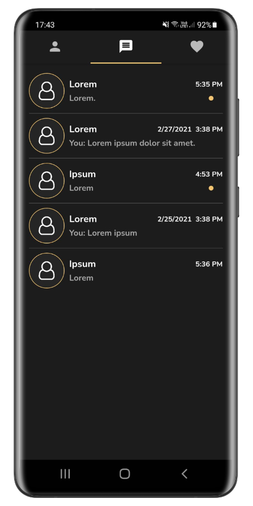 
  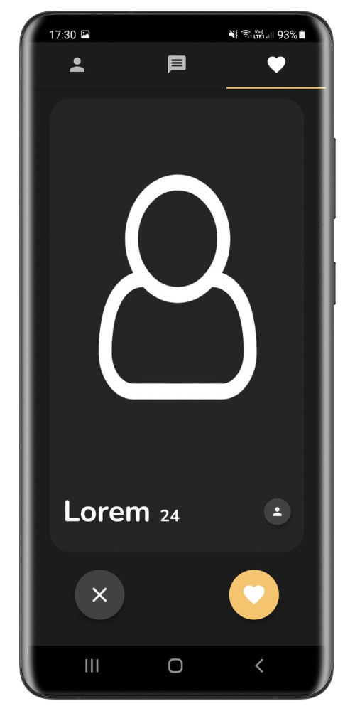 

### Chat | Matched

  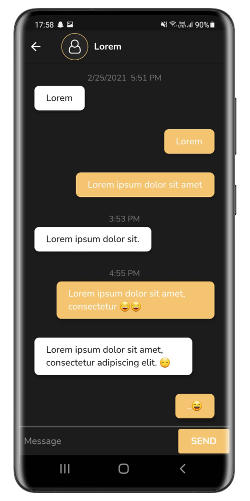
  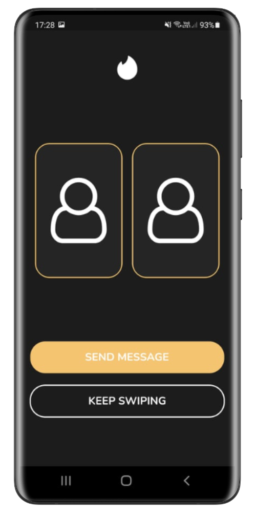

### Firebase

  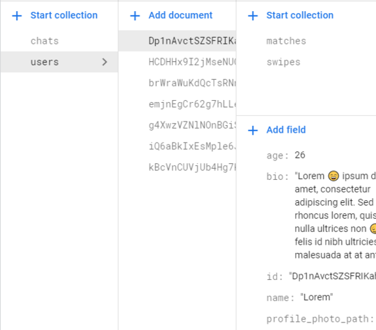 
  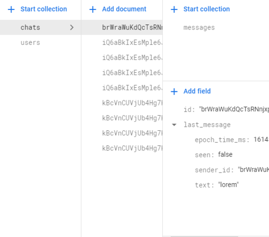 

## Setup

#### Requirements
* Basic knowledge about Flutter
* Basic knowledge about Android
* Basic knowledge about Firebase
* Flutter SDK version >= 2.0.0 (tested and works with 2.0.0)

#### Firebase
* Setup Authentication and use the Sign-in method 'Email/Password'
* Setup Firestore
* Setup Storage
* Replace the file [google-services.json](android/app/google-services.json)

#### Project
1. Download and open the project in e.g Android Studio
2. Connect your Android phone or use the emulator to start the application
